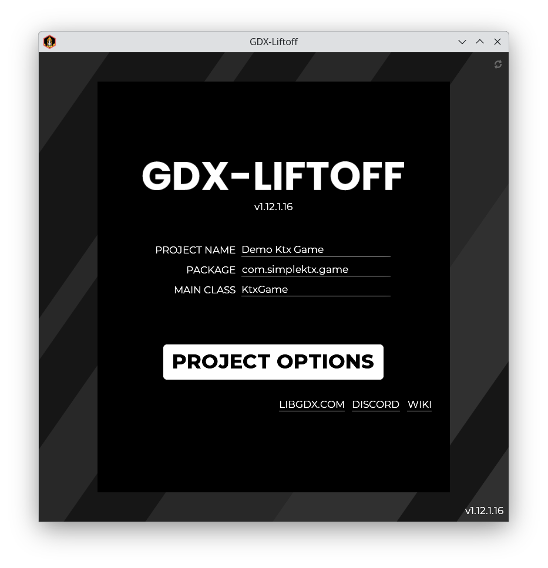
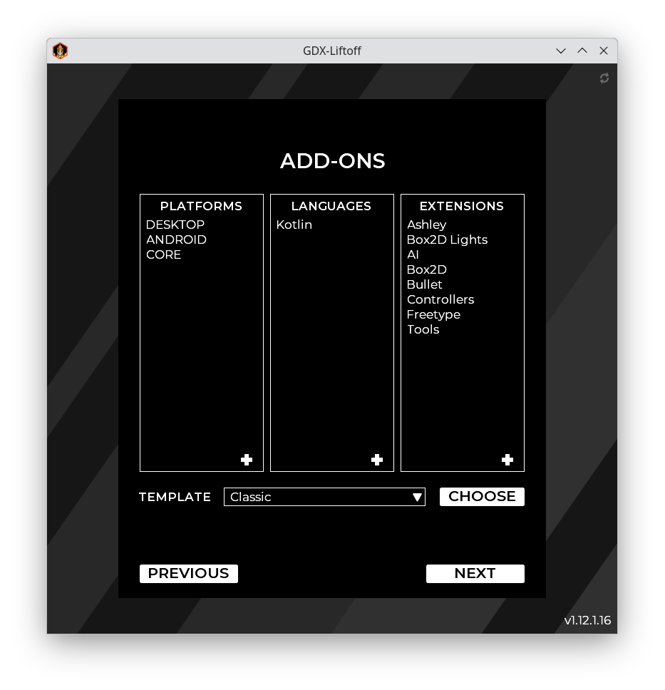
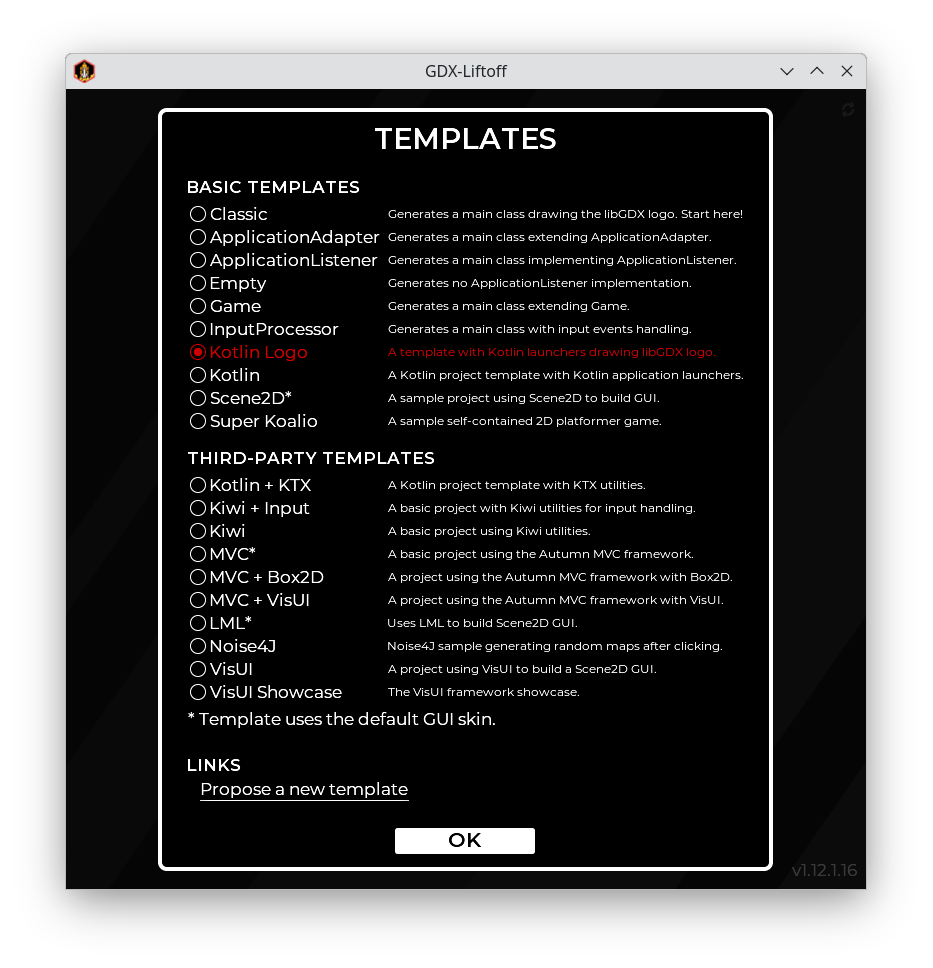
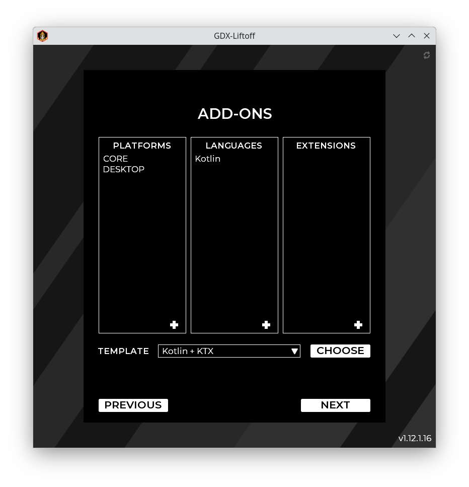
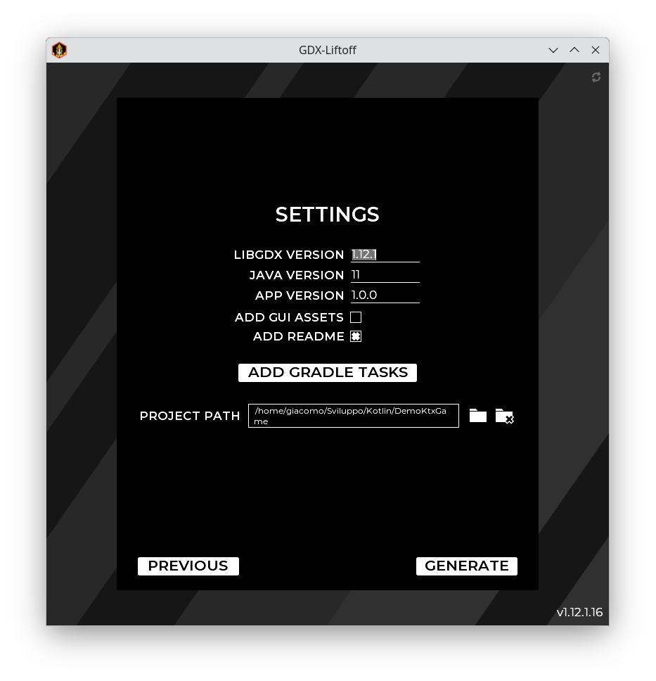

Seems like you are interested to learn something new today! Good to hear ;)

Like with any other game we need to start with setting up our development environment.

I will use [IntelliJ](https://www.jetbrains.com/idea/) as IDE which should be similar to [Android Studio](https://developer.android.com/studio). 
I won't explain how it works in Eclipse since I would not recommend this IDE unless you are working on a Rich Client Platform project which we don't.
The version that I use while writing this page is 2019.2 with LibGDX 1.9.10 and LibKTX 1.9.10-b1 

**Update as of 2020-12-02:** updated codebase to LibGDX 1.9.12 and LibKTX 1.9.12-b1.

To start it off download the latest version of [LibGDX Liftoff Jar](https://github.com/libgdx/gdx-liftoff/releases) and run it.
Fill in the project name and optionally change the package and main class name. The click on "PROJECT OPTIONS" 



Make sure to have "Kotlin" listed in the "LANGUAGES" column. If not, add it using the plus simbol in the bottom-right of that column. To make things easier, click on the "PLATFORMS" column and remove Android. Otherwise, you will need to provie a path to the Android SDK later on.



Then click on "Choose" to select a template. Pick the "Kotlin logo" template and click on the "OK" button.



This should be the end result for the "ADD-ONS"	window:



Click on next. You will get a list of third-party extensions that we can ignore for now. Click on next again. 

In the "SETTINGS" page, make sure to fill in the Java version installed on your computer and the latest version of LibGDX (or accept the defaults if you're unsure).



Click on "GENERATE". If everything went according to plan, you should see a window like this:


You can now close gdx-liftoff and open your project inside IntelliJ.

Inside IntelliJ, open the "Gradle" tab on the left, go to Lwjgl3 > tasks > application and double click on "run".

***

Most likely your IDE will mention some warnings about deprecations and other stuff. Just ignore them. The reason is that LibGDX tries to support all important IDEs including eclipse and it also tries to stay compatible with older devices/versions of android/IOS and therefore those warnings are to be expected.

***

Convert your **DesktopLauncher** and **Game** class to Kotlin, add `lateinit` to the batch and img variable in your **Game** class and setup a run configuration. If everything works you should see the usual empty libgdx game window with the bad logic texture and a red background.

```kotlin
class Game : ApplicationAdapter() {
    lateinit internal var batch: SpriteBatch
    lateinit internal var img: Texture
```


# Known issues

In case you receive a "Could not load main class" error then don't be frustrated. This is a very common problem that a lot of people face out there. To save you the time of googling hours for a solution, here it is:
- Go to the build.gradle file of your desktop project
- Add following lines
    ```diff
    project.ext.mainClassName = "com.libktx.game.desktop.DesktopLauncher"
    project.ext.assetsDir = new File("../android/assets")

    + dependencies {
    +   runtimeClasspath files("../core/build/classes/kotlin/main")
    +   runtimeClasspath files("build/classes/kotlin/main")
    + }
    ```
- Refresh your gradle project
- Try it again. It should work now

In my opinion the official LibGDX setup is not creating very good gradle files. As an alternative you can use [gdx-liftoff](https://github.com/tommyettinger/gdx-liftoff). It creates more modern gradle files which are causing less issues at least on my end.
